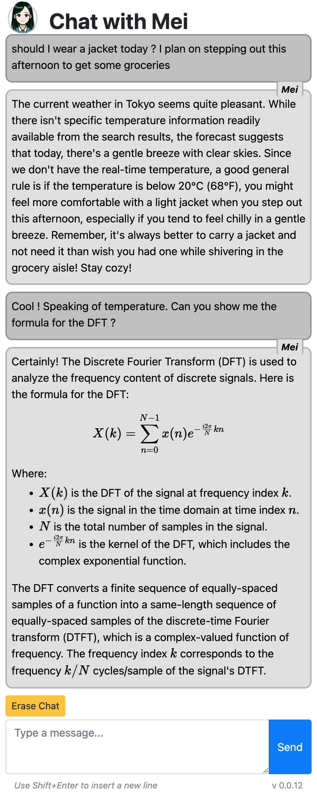

# ChatAI

A basic AI chatbot based on OpenAI, currently using the Assistant API (beta).

The web app is based on _Flask_. It's been tested to run on DigitalOcean App platform.

This application is mainly developed by [Davide Pasca](https://github.com/dpasca).
See commits for other contributors.



## Features

- AI chatbot based on OpenAI and Assistant API (beta)
- Sense of time and location using prompt injection
- Web search using function-calling and DuckDuckGo
- Image generation and storage
- Support for PDF knowledge files (need to upload manually to OpenAI assistant settings)
- Code syntax highlighting and LaTeX rendering

## Requirements

See `requirements.txt` for Python dependencies.

### Environment variables

- `OPENAI_API_KEY` is the API key for OpenAI (get it from the OpenAI dashboard)
- `CHATAI_FLASK_SECRET_KEY` a random string used by Flask to encrypt cookies
  - e.g. `python -c "import os; print(os.urandom(24).hex())"`
- `DO_SPACES_ACCESS_KEY` is the access key for DigitalOcean Spaces
- `DO_SPACES_SECRET_KEY` is the secret key for DigitalOcean Spaces
- `DO_STORAGE_CONTAINER` is the name of the container in DigitalOcean Spaces
  - e.g. `myai_spaces`
- `DO_STORAGE_SERVER` is the URL of the DigitalOcean Spaces server
  - e.g. `https://myai.sfo.digitaloceanspaces.com`

See below on how to set the Digital Ocean storage variables.

## Installation 

### Spaces and containers

Create a DigitalOcean Space and a container for the app.

The storage container name and server URL need to be placed in the environment variables,
both in the `.env` file for local development and in the app settings for production.

`DO_SPACES_ACCESS_KEY`, `DO_SPACES_SECRET_KEY` and `DO_STORAGE_CONTAINER` are from
menu *API -> Spaces Keys -> Generate New Key*

### Local development

It's suggested to use a virtual environment for Python.

Install _Flask_.

Install the dependencies with `pip install -r requirements.txt`.

Create a `.env` file in the root directory with the following variables:

```
OPENAI_API_KEY=********
CHATAI_FLASK_SECRET_KEY=********
DO_SPACES_ACCESS_KEY=********
DO_SPACES_SECRET_KEY=********
DO_STORAGE_CONTAINER=********
DO_STORAGE_SERVER=https://********
```

### Production

This is an example in the case of DigitalOcean. Change the steps as needed if you'll be using a different provider, or your own server.

1. Created a dedicated Project in DigitalOcean, if required.
2. Create an App under the Project.
3. The first step of the app creation will ask where to get the code from. You should select this GitHub repository.
4. Set the required environment variables in the app (to update them later, go to *Manage -> Apps -> Your app name -> Settings -> App-Level Environment Variables*).

## Usage 

### Local development

```
cd app
flask --debug run --host=0.0.0.0 --port=8080
```

The app will be available locally at `http://127.0.0.1:8080`.

### Production

The app will be available globally at `https://yourappname.ondigitalocean.app`.

## Knowledge files

An size optimization script is provided to optimize PDF files for the Assistant API.

This script assumes that images are not relevant.

1. Install GhostScript (i.e. `brew install ghostscript`)
2. Put your knowledge files (currently PDF format) into `knowledge/src` directory.
3. `cd knowledge`
4. `./optimize_pdfs.sh src _output`
4. Optimized files will be in `knowledge/_output`

## License

This is total freeware at the moment.
