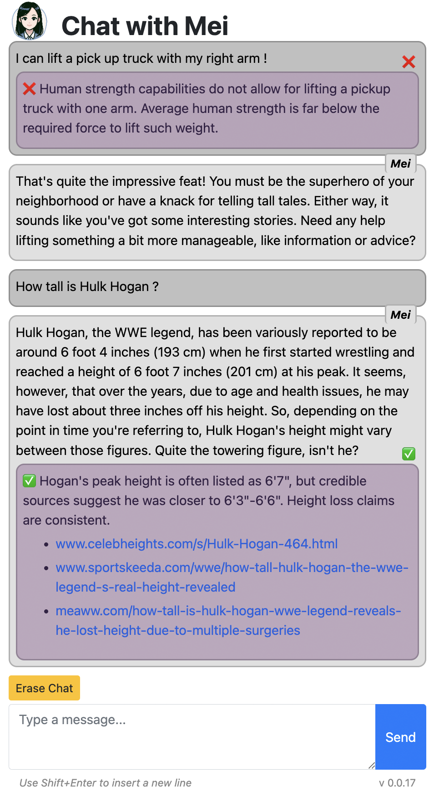

# ChatAI

This is a chatbot based on OpenAI with Assistant API,
implementing agents and function-calling for fact-checking.

It runs both as a **console app** and as a **web app**, with a shared codebase.
The web app is based on _Flask_ and it's tested to run on DigitalOcean App platform.

This application is mainly developed by [Davide Pasca](https://github.com/dpasca).\
See commits for other contributors.



## Features

- AI chatbot based on OpenAI and Assistant API (beta)
- Real-time fact-checking using agents
- Sense of time and location using prompt injection
- Web search using function-calling and DuckDuckGo
- Image generation (Python plotting) and storage
- Support for PDF knowledge files (need to upload manually to OpenAI assistant settings)
- Code syntax highlighting and LaTeX rendering

## Quick start (console app)


### Setup

It's suggested to use a virtual environment for Python.

1. Set `OPENAI_API_KEY` (get it from the OpenAI dashboard) in your
environment variables, or in a `.env` file in the `app_console` directory
2. Install the dependencies: `cd app_console && pip install -r requirements.txt`

### Run

`cd app_console && python main.py`

Use `python main.py --clear` to clear the chat history.

## Web app


### Environment variables

The web app requires the following environment variables.
Set them in the `.env` file for local development and in the app settings for production:

- `OPENAI_API_KEY` is the API key for OpenAI (get it from the OpenAI dashboard)
- `CHATAI_FLASK_SECRET_KEY` a random string used by Flask to encrypt cookies
  - e.g. `python -c "import os; print(os.urandom(24).hex())"`
- `DO_SPACES_ACCESS_KEY` is the access key for DigitalOcean Spaces
- `DO_SPACES_SECRET_KEY` is the secret key for DigitalOcean Spaces
- `DO_STORAGE_CONTAINER` is the name of the container in DigitalOcean Spaces
  - e.g. `myai_spaces`
- `DO_STORAGE_SERVER` is the URL of the DigitalOcean Spaces server
  - e.g. `https://myai.sfo.digitaloceanspaces.com`

See below on how to set the Digital Ocean *storage* variables.

### Spaces and containers

Create a DigitalOcean Space and a container for the app.

The storage container name and server URL need to be placed in the environment variables,
both in the `.env` file for local development and in the app settings for production.

`DO_SPACES_ACCESS_KEY`, `DO_SPACES_SECRET_KEY` and `DO_STORAGE_CONTAINER` are from
menu *API -> Spaces Keys -> Generate New Key*

### Local development

It's suggested to use a virtual environment for Python.

1. Install _Flask_
2. Install the dependencies with `pip install -r requirements.txt`
3. Create a `.env` file in the root directory with the following variables:
```
OPENAI_API_KEY=********
CHATAI_FLASK_SECRET_KEY=********
DO_SPACES_ACCESS_KEY=********
DO_SPACES_SECRET_KEY=********
DO_STORAGE_CONTAINER=********
DO_STORAGE_SERVER=https://********
```

### Production

This is an example for DigitalOcean. Change the steps as needed if you'll be using a different provider, or your own server.

1. Created a dedicated Project in DigitalOcean, if required.
2. Create an App under the Project.
3. The first step of the app creation will ask where to get the code from. You should select this GitHub repository.
4. Set the required environment variables in the app (to update them later, go to *Manage -> Apps -> Your app name -> Settings -> App-Level Environment Variables*).
5. Go to the app's *Overview* page, click on the app name link to go to *Component Settings*.
   - *Source Directory*: blank (default)
   - *Run Command*: `cd app_web && python app.py`

### Usage 

#### Local development

Run with _either_ of the following commands:

- `(cd app_web && python app.py)`
- `(cd app_web && flask --debug run --host=0.0.0.0 --port=8080)`

The app will be available locally at `http://127.0.0.1:8080`.

#### Production

The app will be available globally at `https://yourappname.ondigitalocean.app`.

## Knowledge files

This app uses the Assistant API from OpenAI, which allows to upload knowledge files
in various formats.

After a first run of the app, an assistant with the `assistant_codename` from `config.json`
will show in the the [Assistant API dashboard](https://platform.openai.com/assistants).

Find the assistant there, click on `...` -> `Edit` and add the knowledge files.

### Optimization

A size optimization script is provided for PDF files for the Assistant API.

This script assumes that images are not relevant.

1. Install GhostScript (i.e. `brew install ghostscript`)
2. Put your knowledge files (currently PDF format) into `knowledge/src` directory.
3. `cd knowledge`
4. `./optimize_pdfs.sh src _output`
4. Optimized files will be in `knowledge/_output`
